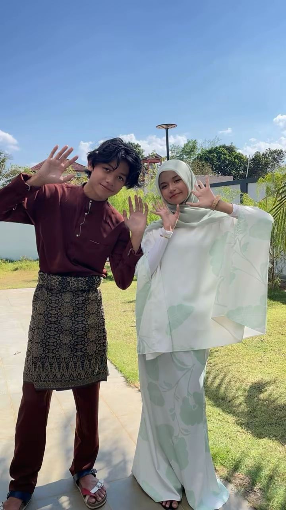

<html lang="ms">
<head>
<meta charset="UTF-8">
<meta name="viewport" content="width=device-width, initial-scale=1.0">
<title>Untuk Putry ❤️</title>

</head>

<body>

<audio autoplay loop>
    <source src="romantic.mp3" type="audio/mpeg">
</audio>

❤️

💖

💕

💘

    <h1>Untuk Putry Nurhanna Lufya binti Radim Amsaya ❤️</h1>

    

        Sejak hadirnya awak dalam hidup saya, semuanya terasa lebih indah.
        Setiap senyuman awak adalah kebahagiaan saya.
          
        <b>Saya sayang awak sepenuh hati 💖</b>
    

    <button onclick="showLove()">Klik sini sayang 💌</button>

    
    

<script>
function showLove(){
    document.getElementById("photo1").style.display="block";
    document.getElementById("photo2").style.display="block";
}

</body>
